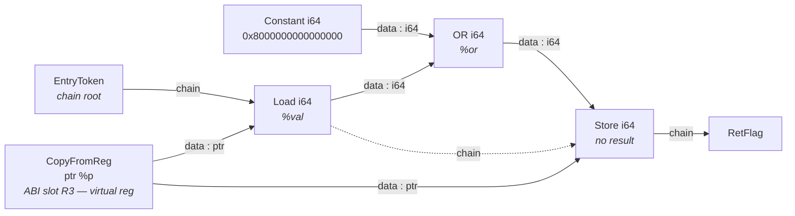

# The LLVM Backend Pipeline — A Deep Dive

**Part of:** [Chapter 1 — LLVM Backend Concepts](ch1-llvm-backend-concepts.md)  
**Reference map:** [pass-source-map.md](pass-source-map.md)

---

## Purpose

After reading this document you will be able to:

1. Trace any value from C source all the way to binary encoding, knowing exactly what LLVM does to it at each step.
2. Open `debug-all-passes.txt`, find the first pass where something looks wrong, look up the source file in the reference map, and read the code that owns that transformation.
3. Root-cause and fix a backend bug without external help.

Each stage uses a PPE42-specific example chosen to make **that stage's work visible**. The examples are not the same program threaded through every stage — they are selected because they exercise the interesting code path at that particular stage.

---

## How to generate the debug dump

```bash
llc -march=ppc32 -mcpu=ppe42 -O2 -print-after-all \
    input.ll -o /dev/null 2> debug-all-passes.txt
```

---

## Stage 0 — LLVM IR (the input)

**What this stage is:** LLVM IR is the common currency between the compiler front end and the backend. `llc` receives this text and never touches C source again.

**Best example to understand it:** A function that loads a 64-bit value and sets its sign bit. This is the canonical PPE42 use-case — a 32-bit processor that handles 64-bit values via VDR register pairs.

```c
// sign_set.c  — set the sign bit of a 64-bit field in a struct
typedef unsigned long long u64;

void set_sign(u64 *p) {
    *p |= 0x8000000000000000ULL;
}
```

The IR `opt` produces at `-O2`:

```llvm
define void @set_sign(ptr %p) {
entry:
  %val = load i64, ptr %p, align 8          ; load the 64-bit value
  %or  = or i64 %val, -9223372036854775808  ; OR with 0x8000000000000000
  store i64 %or, ptr %p, align 8            ; write it back
  ret void
}
```

Key properties of LLVM IR:

- **SSA form** — `%val` and `%or` are each defined exactly once. There is no concept of a register that is written twice.
- **Typed** — `i64` is explicit; the backend must decide how to represent it on a 32-bit machine.
- **Target-independent** — no VDR pairs, no `lvd`/`stvd`, no calling convention registers visible here.
- **CFG** — a single `entry` basic block here; branches create multiple blocks.

---

## Stage 1 — Pre-ISel IR Passes (IR-level, before the DAG)

**What this stage is:** A sequence of IR-to-IR passes that clean up and lower constructs the backend cannot handle directly.

**Best example to understand it:** A function that materialises the same large constant in two places. `Constant Hoisting` (`consthoist`) deduplicates it into one `base + offset` sequence.

```c
// two_stores.c
typedef unsigned long long u64;
void two_stores(u64 *a, u64 *b) {
    *a = 0xDEADBEEF00000000ULL;
    *b = 0xDEADBEEF00000000ULL;   // same large constant
}
```

IR before `consthoist`:

```llvm
define void @two_stores(ptr %a, ptr %b) {
entry:
  store i64 -2401053088657776640, ptr %a  ; 0xDEADBEEF00000000
  store i64 -2401053088657776640, ptr %b  ; same literal again
  ret void
}
```

IR after `consthoist` — the constant is hoisted to a single definition and both stores reference it:

```llvm
define void @two_stores(ptr %a, ptr %b) {
entry:
  %0 = bitcast i64 -2401053088657776640 to i64   ; one materialisation
  store i64 %0, ptr %a
  store i64 %0, ptr %b
  ret void
}
```

Without hoisting, each store would independently emit `LIS rX, 0xDEAD` / `ORI rX, rX, 0xBEEF` for the hi half and similar for the lo half — four instructions instead of two.

**Passes active at this stage:**

```
Pre-ISel Intrinsic Lowering   → replace llvm.memcpy etc. with calls
Expand Atomic                 → lower atomic ops to ll/sc sequences
CodeGen Prepare               → split critical edges, sink computations, address lowering
Constant Hoisting             → deduplicate expensive immediate materialisations
Loop Strength Reduction       → replace multiply-by-induction with add sequences
```

**How to observe:** In `debug-all-passes.txt`, all output between the first pass and `ppc-isel` is still text IR (the `define void @…` syntax).

**Source:** `llvm/lib/CodeGen/CodeGenPrepare.cpp`, `llvm/lib/CodeGen/ConstantHoisting.cpp`.  
See the [reference map](pass-source-map.md) for all pre-ISel passes.

---

## Stage 2 — SelectionDAG Construction and Combining

The DAG is **not a separate pass** in `debug-all-passes.txt`. Building, combining, legalising, and pattern-matching all happen inside the single `ppc-isel` pass. The sub-stages below describe what occurs invisibly inside it.

### 2a — Building the initial DAG

**Best example to understand it:** The `set_sign` IR from Stage 0. Each IR instruction becomes one DAG node; the key insight is that `%val` is a **shared node** — one definition, multiple consumers.

```
IR:  %val = load i64, ptr %p
     %or  = or  i64 %val, 0x8000000000000000
     store i64 %or, ptr %p
```

Initial DAG (before any combining):



**Edge legend:**
- **Solid arrow** — data edge: carries a typed value (`i64`, `ptr`, …)
- **Dashed arrow** — chain edge: enforces memory ordering (Store cannot execute before Load)

**This is acyclic.** What looks like two paths from `Load` to `Store` is a **diamond**, not a cycle:

```
Load --[data]--> OR --[data]--> Store
Load --[chain]-----------.----> Store
```

A cycle would require an edge pointing *back* — e.g. `Store → Load`. No such edge exists. Every arrow goes strictly left-to-right (leaf → root).

The diamond shape is the whole point: `Load` is **one node with two outgoing edges** — a data edge to `OR` (passing the loaded `i64` value forward) and a chain edge directly to `Store` (ensuring the store does not reorder before the load). The value is computed once and shared by both consumers. This is what makes the DAG different from a simple instruction list.

> **Why no physical registers yet?**
> The function argument `%p` arrives as a `CopyFromReg` node backed by a *virtual* register pre-wired to ABI slot R3. Physical register assignment (R3, R4, …) is decided later by the register allocator.

**Source:** `llvm/lib/CodeGen/SelectionDAG/SelectionDAGBuilder.cpp`

### 2b — DAG Combining (`PerformDAGCombine`)

**Best example to understand it:** The same `ISD::OR` of an `i64` with `0x8000000000000000`. This is the combine that exists precisely for PPE42 — it decomposes the 64-bit OR into 32-bit sub-register operations before legalisation can do something more expensive.

The combiner fires when it sees `(or i64, Constant)` and `isPPE42()` is true:

```
Before combine:
  (or i64
    (load i64 ptr)
    (Constant 0x8000000000000000))   ; ImmHi=0x80000000, ImmLo=0x00000000
```

The combine extracts each 32-bit half, ORs only the non-zero half, and reassembles:

```
After PPE42 combine (PPCTargetLowering::PerformDAGCombine, case ISD::OR):
  ; ImmHi=0x80000000, ImmLo=0x00000000
  ; hi half is modified, lo half passes through unchanged (ImmLo==0, no OR emitted)
  HiWord = (EXTRACT_SUBREG sub_gpr_hi, (load i64 ptr))
  LoWord = (EXTRACT_SUBREG sub_gpr_lo, (load i64 ptr))
  NewHi  = (or i32, HiWord, (Constant 0x80000000))
  Step1  = (INSERT_SUBREG sub_gpr_hi, (load i64 ptr), NewHi)
  Result = (INSERT_SUBREG sub_gpr_lo, Step1, LoWord)   ; lo unchanged
```

The combine ORs only the half-words where the constant is non-zero (`ImmHi != 0`). The zero half (`ImmLo == 0`) is passed through without an OR node. Both halves are always written back via `INSERT_SUBREG` to reassemble the VDR pair.

For the **run-of-ones** case (e.g. `0x00000003FF000000`) where both halves are non-zero, the combiner deliberately does **not** fire — it leaves the `ISD::OR` intact so that `tryAsSingleRLDIMI()` in Stage 3 can emit a single `RLDIMI_VDR` instruction instead. See Stage 3 below.

**Source:** `llvm/lib/Target/PowerPC/PPCISelLowering.cpp`  
Entry point: `PPCTargetLowering::PerformDAGCombine()`

### 2c — Legalisation

After combining, the legaliser checks every node against what the target supports. For PPE42, `i64` is declared legal via:

```cpp
// PPCISelLowering.cpp — isPPE42() block inside PPCTargetLowering constructor
addRegisterClass(MVT::i64, &PPC::VDRCRegClass);
```

This means `(load i64)` and `(store i64)` are already legal — the legaliser has nothing to do for them. Had `i64` not been registered, the legaliser would expand every 64-bit load/store into two 32-bit halves, which would produce far worse code.

**Source:** `llvm/lib/CodeGen/SelectionDAG/LegalizeDAG.cpp`,  
`llvm/lib/CodeGen/SelectionDAG/LegalizeTypes.cpp`

---

## Stage 3 — Instruction Selection (`ppc-isel`)

Pass name in debug output: **`PowerPC DAG->DAG Pattern Instruction Selection (ppc-isel)`**

**What this stage is:** DAG nodes become real PowerPC machine instructions. LLVM matches DAG subtrees bottom-up against patterns defined in `.td` files (compiled to a giant switch in `PPCGenDAGISel.inc`). Custom C++ selection code in `PPCDAGToDAGISel::Select()` handles cases the patterns cannot express.

**Best example — LVD selection (`.td` pattern match):**

The `LVD` instruction is defined in `PPCInstrPPEVD.td` (`def LVD`):

```tablegen
def LVD : DForm_1<5, (outs vdrc:$RST), (ins (memri $D, $RA):$src),
                  "lvd $RST, $src", IIC_LdStLoad,
                  [(set i64:$RST, (load iaddr:$src))]>;
```

The pattern `(set i64:$RST, (load iaddr:$src))` means: whenever the DAG contains a 64-bit load from a base+offset address, emit `LVD`. The selector matches this bottom-up:

```
DAG node:    (load i64, (add (FrameIndex), (Constant 0)))
                                  ↓
Pattern match: (set vdrc:$RST, (load iaddr:$src))   [PPCInstrPPEVD.td]
                                  ↓
MachineInstr:  %0:vdrc = LVD %stack.0, 0            (FrameIndex, not yet resolved)
```

**Best example — RLDIMI_VDR selection (custom C++ path):**

When `PerformDAGCombine` sees a run-of-ones constant like `0x00000003FF000000` it leaves the `ISD::OR` node intact. The selector then calls `PPCDAGToDAGISel::tryAsSingleRLDIMI()`:

```
DAG node:   (or i64, %reg, (Constant 0x00000003FF000000))
            ; isRunOfOnes64(0x00000003FF000000) → MB=22, ME=33, SH=30
                                  ↓
tryAsSingleRLDIMI() — isPPE42() branch:
  - materialises -1 via LI8_VDR pseudo
  - emits RLDIMI_VDR with SH=30, MB=22
                                  ↓
MachineInstr:
  %mask:vdrc = LI8_VDR -1              ; pseudo — expanded post-RA
  %out:vdrc  = RLDIMI_VDR %in, %mask, 30, 22
```

Without `tryAsSingleRLDIMI`, the compiler would emit two separate OR instructions (one per half-word), which is worse.

After `ppc-isel`, the debug dump switches from text IR to **MachineInstr** notation:

```
# After ppc-isel:
bb.0.entry:
  %0:gprc = LWZ %fixed-stack.0, 0   ; load ptr arg (lo half of pointer)
  %1:vdrc = LVD %0:gprc, 0          ; 64-bit load → VDR pair
  %2:gprc = EXTRACT_SUBREG %1:vdrc, sub_gpr_hi
  %3:gprc = ORI %2:gprc, 32768      ; set bit 15 of hi word (0x8000)
  %1:vdrc = INSERT_SUBREG %1:vdrc, %3:gprc, sub_gpr_hi
  STVD %1:vdrc, %0:gprc, 0          ; 64-bit store back
  BLR
```

**Entry point for custom selection:** `PPCDAGToDAGISel::Select()` and `PPCDAGToDAGISel::tryAsSingleRLDIMI()` for the RLDIMI special case.  
**Source:** `llvm/lib/Target/PowerPC/PPCISelDAGToDAG.cpp`  
**Generic selector engine:** `llvm/lib/CodeGen/SelectionDAG/SelectionDAGISel.cpp`

---

## Stage 4 — Pre-RA Optimisation Passes

**What this stage is:** A sequence of MachineInstr-level passes that improve code quality before the register allocator runs. Virtual registers are still in use throughout.

**Best example — Machine CSE eliminating a redundant sub-register extract:**

After ISel, both an `STVD` spill and an `ORI` on the hi-half may independently extract `sub_gpr_hi` from the same VDR:

```
# Before machine-cse:
  %3:gprc = COPY %1:vdrc:sub_gpr_hi     ; for the ORI
  %4:gprc = COPY %1:vdrc:sub_gpr_hi     ; independently for a second use
```

`machine-cse` recognises both `COPY`s produce the same value and replaces the second with a use of `%3`:

```
# After machine-cse:
  %3:gprc = COPY %1:vdrc:sub_gpr_hi     ; one extraction kept
  ; %4 eliminated — all uses rewritten to %3
```

This matters for VDR code because the sub-register extract pattern appears repeatedly whenever the combiner decomposes a 64-bit operation into two 32-bit halves.

**Passes active at this stage:**

```
Finalize ISel                  → expand pseudo-instructions from ISel
Early Tail Duplication         → duplicate small blocks to enable fall-through
Optimize machine PHIs          → simplify trivial phi nodes
Stack Slot Coloring (early)    → assign disjoint frame slots to same stack memory
Machine InstCombiner           → peephole on MachineInstrs (e.g. fold add+shift)
Early If-Conversion            → convert small if-else to conditional moves
Machine CSE                    → eliminate redundant MachineInstr computations
Peephole Optimizations         → (PPCMIPeephole) PPC-specific micro-optimisations
```

**Key source for PPC-specific pre-RA peephole:**  
`llvm/lib/Target/PowerPC/PPCMIPeephole.cpp`

---

## Stage 5 — Register Allocation (`greedy`)

Pass name: **`Greedy Register Allocator (greedy)`**

**What this stage is:** Every virtual register is mapped to a physical register. If there are not enough physical registers, the allocator inserts spill and reload instructions.

### How the greedy allocator works

1. **Live range analysis** — computes where each virtual register is alive (which instructions it spans).
2. **Interference graph** — two virtual registers *interfere* if they are live at the same time; they cannot share a physical register.
3. **Greedy assignment** — processes live ranges in priority order (longest first). Assigns physical registers from the register class's allocation order. If no register is free, **evicts** a lower-priority live range or **splits** the current range.
4. **Spilling** — if a live range cannot be assigned, it is spilled: `storeRegToStackSlot` inserts a store; `loadRegFromStackSlot` inserts a reload.

### Best example — VDR pair assignment and spill

Consider a function with four simultaneous live 64-bit values:

```
Virtual regs after ppc-isel (all :vdrc):
  %0:vdrc   %1:vdrc   %2:vdrc   %3:vdrc
```

VDRC contains 13 consecutive-GPR pairs defined in `PPCRegisterInfo.td` via `def VDRTuples`:

```
R0/R1, R2/R3, R3/R4, R4/R5, R5/R6, R6/R7, R7/R8,
R8/R9, R9/R10, R28/R29, R29/R30, R30/R31, R31/R0
```

They are **not** all even–odd pairs — the first GPR of each pair is any valid VDR base register. The allocator assigns available pairs in allocation order:

```
%0:vdrc → $r4_r5
%1:vdrc → $r6_r7
%2:vdrc → $r8_r9
%3:vdrc → $r9_r10
```

If a fifth VDR is live simultaneously and no pair is free, the lowest-priority range is **spilled**. The spill opcode is chosen by:

```cpp
// PPCInstrInfo.cpp — PPCInstrInfo::getSpillIndex(), VDRCRegClass branch
OpcodeIndex = SOK_VDRSpill;
// getStoreOpcodeForSpill() returns StoreSpillOpcodesArray[getSpillTarget()][SOK_VDRSpill]
// → PPC::STVD  (single 64-bit store, D-form)
```

The spill instructions inserted at this stage use **FrameIndex** placeholders — the exact stack offset is not yet known:

```
# Spill inserted after greedy RA:
  STVD $r28_r29, %stack.0, 0    ← %stack.0 is FrameIndex #0, offset TBD
# Reload:
  %5:vdrc = LVD %stack.0, 0
```

**Spill insertion source:** `llvm/lib/Target/PowerPC/PPCInstrInfo.cpp`  
`PPCInstrInfo::storeRegToStackSlot()` and `loadRegFromStackSlot()`  
Spill opcode lookup: `PPCInstrInfo::getSpillIndex(RC)` returns a `SOK_*` index; `getStoreOpcodeForSpill(RC)` uses it to index into `StoreSpillOpcodesArray[getSpillTarget()]` (row selected by CPU generation). Both are declared in `PPCInstrInfo.h`.

**Generic allocator:** `llvm/lib/CodeGen/RegAllocGreedy.cpp`

---

## Stage 6 — Post-RA Passes

### Virtual Register Rewriter (`virtregrewriter`)

Replaces every virtual register operand with the physical register the greedy allocator assigned to it, using the `VirtRegMap` lookup table built during allocation. Also resolves sub-register references to concrete physical sub-registers (e.g. `%1:vdrc:sub_gpr_hi` → `$r4`), and removes identity copies that became no-ops after assignment (e.g. `$r4_r5 = COPY $r4_r5`).

> **Why are virtual registers still present after the RA runs?** The greedy allocator decides assignments and records them in `VirtRegMap`, but deliberately defers patching the instructions — it creates new virtual registers during live-range splitting and spilling that are still pending assignment when earlier instructions are processed. `virtregrewriter` does a single clean pass at the end once all assignments are final.
> **Deep dive:** [virtregrewriter-why-vregs-survive-ra.md](virtregrewriter-why-vregs-survive-ra.md)

**PPE42 example:**

```
# After greedy RA — VirtRegMap records: %1→$r4_r5, %3→$r6
# Instructions still contain virtual register operands:

  %3:gprc = COPY %1:vdrc:sub_gpr_hi

# virtregrewriter resolves:
#   %1 → $r4_r5, then sub_gpr_hi of $r4_r5 → $r4
#   %3 → $r6

  $r6 = COPY $r4                   ← physical regs, sub-reg index gone
```

### Frame Index Elimination (inside `prologepilog`)

Pass name: **`Prologue/Epilogue Insertion & Frame Finalization (prologepilog)`**

**Best example to understand it:** The STVD spill inserted in Stage 5. At this point the stack frame size is known, so every `FrameIndex` placeholder can be resolved to a real `r1 + offset`.

```
# Before prologepilog (FrameIndex still abstract):
  STVD $r28_r29, 0, %stack.0

          ↓  PPCRegisterInfo::eliminateFrameIndex()
          ;  FrameIndex #0 → offset 16 from r1 (after stack frame is sized)

# After prologepilog (concrete r1+offset):
  STVD $r28_r29, 16, $r1      ; "stvd d28, 16(r1)"
```

`eliminateFrameIndex` looks up `STVD` in `ImmToIdxMap`. The entry is:

```cpp
// PPCRegisterInfo.cpp — PPCRegisterInfo constructor, ImmToIdxMap population
ImmToIdxMap[PPC::STVD] = PPC::STVD;   // self-mapped: D-form offset path
```

Because `ImmToIdxMap.count(PPC::STVD)` is true, `noImmForm` is false. The offset (16) fits in 16 bits (`isInt<16>(16)` → true), so the fast path fires: the FrameIndex operand is replaced with `$r1` and the offset immediate is patched to 16. No opcode change needed.

The prologue (`stwu r1, -N(r1)`) and epilogue (`lwz r1, 0(r1)` / `blr`) are also inserted here.

**Source:** `llvm/lib/CodeGen/PrologEpilogInserter.cpp`  
**PPC-specific frame logic:** `llvm/lib/Target/PowerPC/PPCFrameLowering.cpp`  
**Frame index resolution:** `llvm/lib/Target/PowerPC/PPCRegisterInfo.cpp`  
`PPCRegisterInfo::eliminateFrameIndex()`

### Post-RA Pseudo Expansion (`postrapseudos`)

Pass name: **`Post-RA pseudo instruction expansion pass (postrapseudos)`**

**Best example to understand it:** `LI8_VDR` materialising a 64-bit constant. The pseudo was kept opaque through register allocation (RA assigns a VDR pair to it as a unit); now physical registers are known and the pseudo can be split into real instructions.

**Case A — constant with distinct hi and lo halves** (e.g. `0xDEADBEEF12345678`):

```
Before:  LI8_VDR $r4_r5, 0xDEADBEEF12345678
         ↓  PPCInstrInfo::expandPostRAPseudo()
         ;  ImmHi=0xDEADBEEF  Hi16=0xDEAD  Lo16=0xBEEF (both non-zero)
         ;  ImmLo=0x12345678  Hi16=0x1234  Lo16=0x5678 (both non-zero)
After:   $r4 = LIS -8531       ; LIS 0xDEAD (sign-extended)
         $r4 = ORI $r4, 48879  ; ORI 0xBEEF → hi word complete
         $r5 = LIS 4660        ; LIS 0x1234
         $r5 = ORI $r5, 22136  ; ORI 0x5678 → lo word complete
```

**Case B — constant with zero lo half** (e.g. `0x8000000000000000`):

```
Before:  LI8_VDR $r5_r6, 0x8000000000000000
         ↓  PPCInstrInfo::expandPostRAPseudo()
         ;  ImmHi=0x80000000  Hi16=0x8000  Lo16=0x0000
         ;  ImmLo=0x00000000  Hi16=0x0000  Lo16=0x0000
After:   $r5 = LIS -32768      ; hi half: LIS 0x8000 (no ORI needed, Lo16==0)
         $r6 = LI 0            ; lo half: LI 0 (always emitted)
```

> **Note:** Both halves are always materialised unconditionally — `LI rLo, 0` is emitted even when `ImmLo == 0`. There is no zero-skip for either half.

The `EmitWord` helper (inside `expandPostRAPseudo`) chooses the most compact sequence per 32-bit word:
- `Hi16 == 0` and `(Lo16 & 0x8000) == 0` → single `LI` (no sign-extension hazard)
- otherwise → `LIS` + `ORI` if `Lo16 != 0`, or just `LIS` if `Lo16 == 0`

**Source:** `llvm/lib/Target/PowerPC/PPCInstrInfo.cpp`  
`PPCInstrInfo::expandPostRAPseudo()`  
Generic pass: `llvm/lib/CodeGen/ExpandPostRAPseudos.cpp`

---

## Stage 7 — Final Optimisation and Assembly Emission

```
PostRA Machine Sink       → sink instructions toward their use points
Branch Folder             → remove redundant unconditional branches
If Converter              → convert remaining if-else to predicated instrs
PostRA Scheduler          → reorder instructions to hide latency
PPC Pre-Emit Peephole     → final PPC-specific micro-opts before emission
PPC Branch Selector       → replace long branches with jump-through-CTR
Linux PPC Assembly Printer → emit .s text or encode .o bytes
```

**Best example — final assembly for `set_sign`:**

```asm
set_sign:
        stwu    r1, -16(r1)        ; prologue: allocate 16-byte frame
        lwz     r4, 20(r1)         ; load ptr argument (r3 = ptr, passed on stack)
        lvd     d3, 0(r4)          ; d3 = *p  (64-bit load into VDR pair r6:r7)
        oris    r6, r6, 32768      ; set bit 31 of hi word: 32768 = 0x8000
        stvd    d3, 0(r4)          ; *p = d3  (64-bit store back)
        lwz     r1, 0(r1)          ; epilogue: restore r1
        blr
```

The `oris r6, r6, 32768` is the remnant of the `NewHi = (or i32, HiWord, 0x80000000)` node from Stage 2b. The `lvd`/`stvd` are the pattern-matched LVD/STVD instructions from Stage 3.

**Assembly printer source:** `llvm/lib/Target/PowerPC/PPCAsmPrinter.cpp`  
**MC encoder (for -filetype=obj):** `llvm/lib/Target/PowerPC/MCTargetDesc/PPCMCCodeEmitter.cpp`  
**Instruction printer (for -filetype=asm):** `llvm/lib/Target/PowerPC/MCTargetDesc/PPCInstPrinter.cpp`

---

## Annotated Pipeline Diagram

```
C source  (set_sign / two_stores / sign_set)
    │  (clang frontend)
    ▼
LLVM IR  ──────────────────────────────────────────────────────── Stage 0
    │   (i64 typed, SSA, no registers, no opcodes)           text IR
    │
    │  Pre-ISel IR passes (consthoist deduplicates constants,
    │                      codegenprepare lowers address modes, …)
    ▼
LLVM IR (lowered, constants hoisted)  ───────────────────────── Stage 1
    │                                                          text IR
    │  ┌──────────────────────────────────────────────────┐
    │  │  ppc-isel  (SelectionDAG internals)              │
    │  │  ① Build DAG: IR → typed SDValue nodes           │
    │  │  ② DAG Combine: ISD::OR → EXTRACT/INSERT_SUBREG  │
    │  │     (or defer to tryAsSingleRLDIMI for RLDIMI)   │
    │  │  ③ Legalise: i64 legal via VDRCRegClass          │  Stage 2+3
    │  │  ④ DAG Combine again (post-legalise)             │
    │  │  ⑤ Pattern match → LVD / STVD / RLDIMI_VDR /    │
    │  │     LI8_VDR / OR8_VDR (MachineInstr pseudos)    │
    │  └──────────────────────────────────────────────────┘
    ▼
MachineInstr (SSA, virtual regs, pseudos still present)  ─────── Stage 3
    │                                                 MachineInstr text
    │  Pre-RA optimisations (machine-cse removes duplicate
    │                        sub-reg extracts; machine-combiner
    │                        folds add+shift; PPCMIPeephole …)
    ▼
MachineInstr (SSA, virtual regs, optimised)  ──────────────────── Stage 4
    │
    │  greedy register allocator
    │    ├── assigns VDR pairs (r4:r5, r6:r7, …) to :vdrc virtregs
    │    └── inserts STVD/LVD spill pairs (FrameIndex placeholders)
    ▼
MachineInstr (physical regs, FrameIndexes)  ────────────────────── Stage 5
    │
    │  virtregrewriter: replace all virtual reg references
    │
    │  prologepilog
    │    ├── inserts prologue (stwu r1, -N(r1)) + epilogue
    │    └── eliminateFrameIndex(): FrameIndex → r1+offset
    │        (STVD fast-path: ImmToIdxMap[STVD]=STVD, noImmForm=false)
    │
    │  postrapseudos
    │    └── expands LI8_VDR → LIS/ORI/LI per half-word
    │        expands OR8_VDR → OR rD_hi,rA_hi,rB_hi + OR rD_lo,…
    │
    │  Post-RA optimisations + branch folding
    ▼
MachineInstr (final, all resolved)  ────────────────────────────── Stage 6
    │
    │  PPCAsmPrinter / PPCMCCodeEmitter
    ▼
.s text  or  .o ELF binary  ────────────────────────────────────── Stage 7
```

---

## How to Root-Cause a Backend Bug

### Step 1 — Generate the debug dump

```bash
llc -march=ppc32 -mcpu=ppe42 -O2 -print-after-all \
    input.ll -o /dev/null 2> debug.txt
```

### Step 2 — Find the first wrong output

Open `debug.txt`. Search for the instruction or value that looks wrong. Find the **earliest pass** where it first appears in its broken form. Everything before that pass is innocent.

Example from Chapter 5:
```
# After greedy:            ← d28 spill appears here
  STVD $r28_r29, 0, FI#2  ← FI#2 = FrameIndex, offset=0, looks fine

# After prologepilog:      ← FI#2 is resolved here
  STVD $r28_r29, 0, $r1   ← operand order WRONG (r1 where imm should be)
```
→ Bug is in `eliminateFrameIndex` (called from `prologepilog`).

### Step 3 — Look up the source file

Go to [pass-source-map.md](pass-source-map.md), find the pass ID in the right column, read the source file.

### Step 4 — Find the code path

For `prologepilog` → `PPCRegisterInfo::eliminateFrameIndex()` in `PPCRegisterInfo.cpp`.  
Search for the opcode involved. For `STVD`:
```bash
grep -n "STVD\|LVD\|ImmToIdxMap\|noImmForm" llvm/lib/Target/PowerPC/PPCRegisterInfo.cpp
```

### Step 5 — Reason about the invariants

Read `eliminateFrameIndex`. Check: is the instruction in `ImmToIdxMap`? What is `noImmForm`? What path does the code take? The bug becomes visible from the logic.

---

*Reference: [pass-source-map.md](pass-source-map.md) — complete mapping of every `print-after-all` pass to its source file.*  
*Back: [Chapter 1 — LLVM Backend Concepts](ch1-llvm-backend-concepts.md)*
